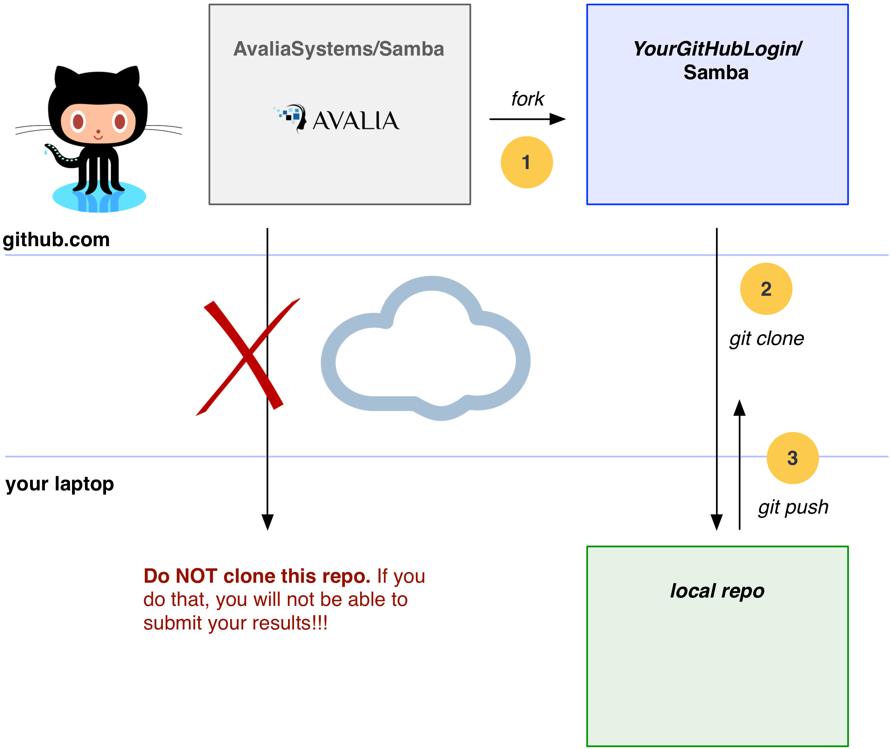
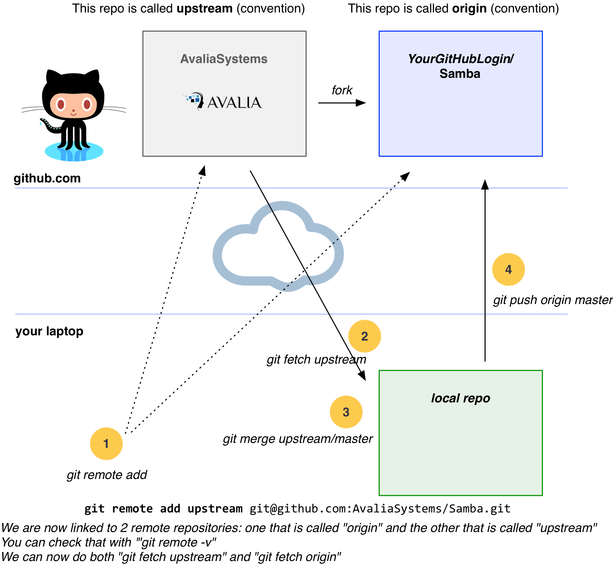
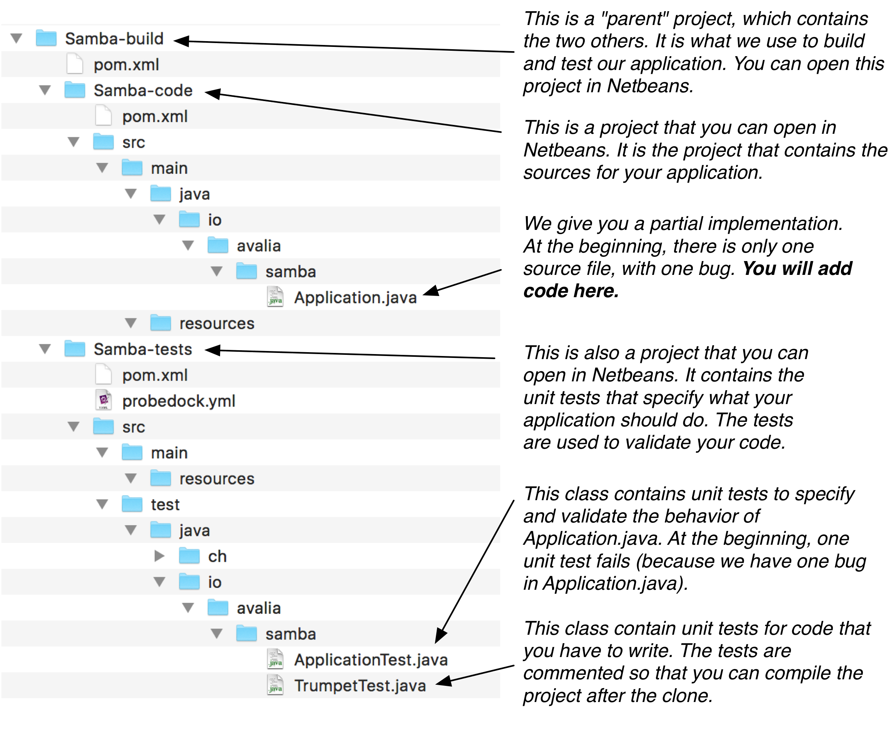
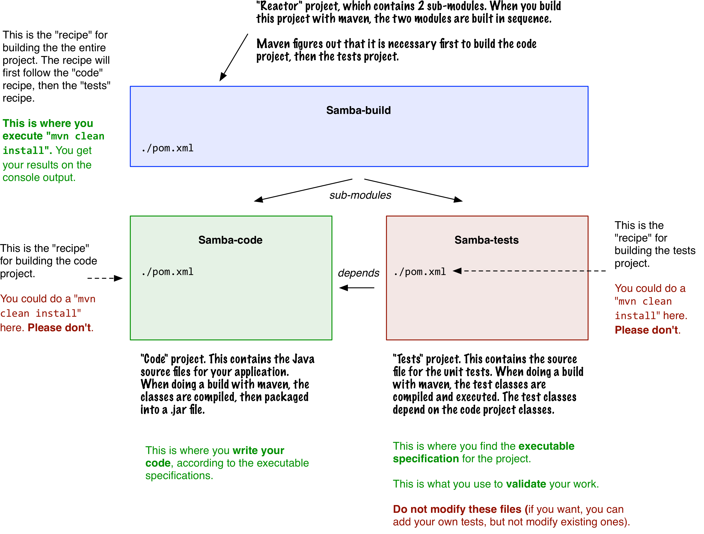
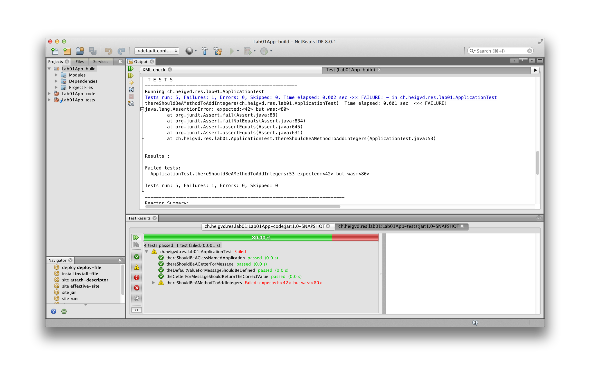

[](https://travis-ci.org/AvaliaSystems/Samba)

### Introduction

* **Task 1** : Register on services and get your IDs
* **Task 2** : Setup the environment
* **Task 3** : Fork this GitHub repo
* **Task 4** : Understand the project structure
* **Task 5** : Develop the Java code according to the executable specification
* **Task 6** : Submit your results

-----

### Task 1 : Make sure you have a GitHub account

1. If you don't have a **GitHub** account yet, get one [here](https://github.com/).
3. Please give us your GitHub ID in this [Google Sheet](https://docs.google.com/a/avalia.systems/spreadsheets/d/1WR6xXc7ySaa6w2RGmrQZ7igft3xzPSUwYUCLEIYRfqU/edit?usp=sharing).


-----

### Task 2 : Setup the environment


#### 2.1. Make sure that you have git installed on your machine

Configure your **SSH keys** to access GitHub, as indicated [here](https://help.github.com/articles/connecting-to-github-with-ssh/)


#### 2.2. Make sure that you have a JDK installed

#### 2.3. Install apache maven

Installing maven on your machine is easy. Just go [here](http://maven.apache.org/download.cgi#Installation) and follow the instructions. When you are done, make sure to update your system path so that you can invoke maven with the `mvn` command from a terminal, wherever your are. If you are using Windows, [this](http://crunchify.com/how-to-setupinstall-maven-classpath-variable-on-windows-7/) page might be helpful.

When you have installed maven, you should be able to type `mvn -v` on the command line.


#### 2.4. Install NetBeans (optional)


-----

### Step 3 : Fork the GitHub repo

Ok, now that your environment is setup, **time to get to the real work**. For the labs, we will be using a **collaborative development workflow**. You have to be familiar with git and the GitHub service. Here is a high-level description of the workflow:


2. You will first **fork** the AvaliaSystems/Samba repo. Read this sentence again very carefully: we said **fork** and **not clone**. Forking the lab repo means that you will have your own copy of the lab repo hosted on GitHub, so that you can work independently. You will then **clone your fork** on your machine. Once again, what you are cloning is your fork, not the original repo. Got it?



3. You will then work on the assignment, write code do you tests. You should get used to commit your work on a regular basis (which means that you will have a local history). When you are done, you will **push** your commits to your fork. You will then create a **pull request**, so that we know that you are done (and it's a way for us to provide feedback on the code).

4. After submission, we will check your forks. We have our own suite of automated tests, which we will use to evaluate your work.

5. You should also configure a link to the upstream repo (AvaliaSystems/Samba), so that you can fetch the commits added after your initial fork (there is no way to get them via the GitHub UI). You do that with the git remote add command.




-----

### Task : Understand the project structure

If you have followed the previous instructions, then you should now have a clone of your fork on your machine, in a directory named `Samba`. Let's check what is inside:



If you look carefully, you will see that there are 3 files named `pom.xml` in the directory structure. These files are used by **maven** and you can think of them as 3 recipes for building our application. As indicated in the diagram, we actually have 3 projects. One with the application code, one with the automated tests and one on top of them. What we are going to do is build the top-level project. Maven will automatically compile the application code, compile the test code, run the tests and give us results. If all tests pass, then Maven will also produce a .jar file.



-----


### Task 5 : Develop the Java code according to the executable specification

**Note**: if you want to have a preview of what you will do, have a look at this [webcast](https://www.youtube.com/watch?v=8LFbasLgM-M&list=PLfKkysTy70Qb_mfkkqa5OUMqsOPNEYZIa&index=2) and at [this one](https://www.youtube.com/watch?v=P3aMCCuAFv0&list=PLfKkysTy70Qb_mfkkqa5OUMqsOPNEYZIa&index=3).

Before opening Netbeans, let's build our software from the command line. To do that, we have to move into the top-level project, where the first `pom.xml` file is located and type the following command: `mvn clean install`. By doing that, we are asking maven to clean the workspace and to start the build process. You will see a long output on the console, starting with this:

```
$ cd Samba/
$ cd Samba-build/
$ mvn clean install
[INFO] Scanning for projects...
[INFO] ------------------------------------------------------------------------
[INFO] Reactor Build Order:
[INFO] 
[INFO] Samba-code
[INFO] Samba-tests
[INFO] Samba-build
[INFO]                                                                         
[INFO] ------------------------------------------------------------------------
[INFO] Building Samba-code 1.0-SNAPSHOT
[INFO] ------------------------------------------------------------------------
[INFO] 
...
```

If you go back in the terminal (and that is one first example that shows how important it is to have a proper command line tool!), you will notice the following section:

```
-------------------------------------------------------
 T E S T S
-------------------------------------------------------
Running io.avalia.samba.ApplicationTest
Tests run: 5, Failures: 1, Errors: 0, Skipped: 0, Time elapsed: 0.002 sec <<< FAILURE! - in io.avalia.samba.ApplicationTest
thereShouldBeAMethodToAddIntegers(io.avalia.samba.ApplicationTest)  Time elapsed: 0 sec  <<< FAILURE!
java.lang.AssertionError: expected:<42> but was:<80>
	at org.junit.Assert.fail(Assert.java:88)
	at org.junit.Assert.failNotEquals(Assert.java:834)
	at org.junit.Assert.assertEquals(Assert.java:645)
	at org.junit.Assert.assertEquals(Assert.java:631)
	at io.avalia.samba.ApplicationTest.thereShouldBeAMethodToAddIntegers(ApplicationTest.java:53)


Results :

Failed tests: 
  ApplicationTest.thereShouldBeAMethodToAddIntegers:53 expected:<42> but was:<80>

Tests run: 5, Failures: 1, Errors: 0, Skipped: 0
```

Very interesting: we see that 5 tests have been successfully run and that one has failed. We see that there seems to be a bug in the method that computes the sum between two integers... Indeed, if we look at the code, we see that the code of the `add(int a, int b)` method is wrong:

```
$ cat Samba-code/src/main/java/io/avalia/samba/Application.java 
package io.avalia.samba.lab00;

/**
 * This is a very simple class used to demonstrate the specify-implement-validate
 * cycle. All methods used in the JUnit test are defined, so the test class will
 * compile. There is a bug in the add method, so one of the tests is expected
 * to fail.
 * 
 * If you look at the class named ApplicationTest, you will
 * find an executable specification for this class. The test methods specify
 * the expected behavior for this class.
 * 
 * @author Olivier Liechti
 */
public class Application {

  private String message;

  public Application() {
    this("HEIG-VD rocks!");
  }

  public Application(String message) {
    this.message = message;
  }

  public String getMessage() {
    return message;
  }

  public int add(int a, int b) {
    return a * b;
  }

}
```

After fixing the bug, we do another `mvn clean install` and this time, we see the following output:

```
-------------------------------------------------------
 T E S T S
-------------------------------------------------------
Running io.avalia.samba.ApplicationTest
Tests run: 5, Failures: 0, Errors: 0, Skipped: 0, Time elapsed: 0.002 sec - in io.avalia.samba.ApplicationTest

Results :

Tests run: 5, Failures: 0, Errors: 0, Skipped: 0
```

Sweet. Our implementation now is compliant with the executable specification. Well, that's because some unit tests have been commented out. Open the `TrumpetTest.java` file and uncomment the unit tests. Note that if you try to build the project now, it will fail. The reason is that the tests specify that you should have created interfaces and classes. You have not done that yet, and it is your assignment in this lab. 

If you read the name of the test methods, you will see that they are a way to specify the expected behavior of your application (that is why we speak of executable specification):

```
thereShouldBeAnIInstrumentInterfaceAndATrumpetClass
itShouldBePossibleToPlayAnInstrument
aTrumpetShouldMakePouet
aTrumpetShouldBeLouderThanAFlute
aTrumpetShouldBeGolden
```
To get all the details of the specification, you will have to take a close look at the body of the methods, such as this one. It should be pretty straightforward to determine what you have to implement in the `Lab00App-code` project (do **not** add the application classes in the `Samba-tests` project!).

```
  @Test
  public void aTrumpetShouldMakePouet() {
    IInstrument trumpet = new Trumpet();
    String sound = trumpet.play();
    Assert.assertEquals("pouet", sound);
  }
```

What we have done in the terminal can also be done directly in Netbeans:

- open the Samba-build project

- right-click on the Samba-build node in the Project tab and select *Open Required Project > Open All Projects*

- righ-click on the Samba-build node and select *Test*

You will see the following output in the IDE tabs. In the *Output* tab, you will see the same output that was generated when invoking maven on the command line. In the *Test Results* tab, you will see a user friendly visual representation of the test results. 

**After cloning the repo, you see 4 green tests and 1 red test. When you have finished the lab, you should see 10 green tests.**




### Task 6 : Submit your results

When you are done, you have to make sure that you push your changes to your fork hosted on GitHub. Indeed, to check your work, we will get the last version of your fork and run our test suite on your code.

Typically, what you will do is the following:

```
# We have modified several local files. We want to take a snapshot
# of files xxx.java and xx2.java and add it to the project history

git add xxx.java
git add xx2.java


# The staging area contains the 2 files. We can now create a local
# commit and provide a message

git commit -m "Implementation of xxx according to specification"


# Finally, we want to send the commit to the fork, so that it is visible
# for other users

git push origin master
```

Last but not least, we ask you to make a **pull request**. In a typical open source project, the following workflow is used by contributors:

1. The contributor wants to **make a contribution** (create a new feature, fix a bug, contribute to the documentation), so he **creates a fork**.
2. (*optional*) The contributor creates a **feature branch**.
3. The contributor **implements** a new feature or fixes a bug in his fork.
4. The contributor **does not have write access on the upstream server** (the original repo for the open source project)
5. For this reason, he **asks** the people who have the right to commit code on the upstream server to **pull** changes from the fork
6. On GitHub, this is not done by phone or email, but via the Web UI. On the fork home page, there is a "Pull Requests" menu. Clicking on the green button labeled *New pull request* initiates the process.
7. The committers review the submitted commits. They can add line-by-line comments, discuss with the contributor, etc. In the end, **they may accept or reject the pull request**.

In our workflow, we will most likely **not** accept your pull requests. However, having a pull request is a nice way to **notify us** that you are done with the implementation. It also give us a mechanism to give you **line-by-line feedback**.

